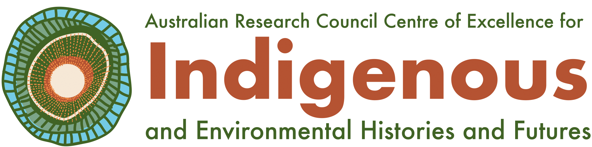

# Island biogeography predicts vertebrate trait space

 
Corey Bradshaw 
<a href="http://globalecologyflinders.com">Global Ecology</a>, Flinders University, Australia 
<a href="mailto:corey.bradshaw@flinders.edu.au">e-mail</a> 
 
John Llewelyn 
<a href="http://globalecologyflinders.com">Global Ecology</a>, Flinders University, Australia 
<a href="mailto:john.llewelyn@flinders.edu.au">e-mail</a> 
 
Accompanies paper: 
 
Bradshaw, CJA, A Naglis, F Saltré, C Mudge, J Llewelyn. Island biogeography similarly predicts species and trait diversity of vertebrate communities on oceanic islands (in preparation) 

## <a href="https://github.com/cjabradshaw/AusIslBiogeogrTraits/tree/main/data/scripts">Scripts</a>
- <code>islbiogeogrtraits.R</code>: R code for all analyses

## <a href="https://github.com/cjabradshaw/AusIslBiogeogrTraits/tree/main/data">Data</a>
### <a href="https://github.com/cjabradshaw/AusIslBiogeogrTraits/tree/main/data/gis">GIS layers</a>
- <em>ausislavala.zip</em>: <a href="https://www.ala.org.au">Atlas of Living Australia</a> data for bird 🦅 species (shapefile). Due to Github file-size constraints, we have broken the zip file into similar-sized chunks. Combine chunks aa to ah using the following Terminal (or equivalent) command: <code>cat ausislavalazip_chunk_* > ausislavala.zip</code>. Once chunks are recombined, unzip the corresponding shapefile.
- <em>reptislavala.zip</em>: <a href="https://www.ala.org.au">Atlas of Living Australia</a> data for reptile 🦎 species (shapefile).
- <em>mamaislavala.zip</em>: <a href="https://www.ala.org.au">Atlas of Living Australia</a> data for mammal 🦘 species (shapefile).
- <em>amphislavala.zip</em>: <a href="https://www.ala.org.au">Atlas of Living Australia</a> data for amphibians 🐸 species (shapefile).
- <em>ausislands.zip</em>: Australian islands shapefile (Australian Albers Equal Area projection). Derived from the <a href="http://www.abs.gov.au/statistics/standards/australian-statistical-geography-standard-asgs-edition-3/jul2021-jun2026/access-and-downloads/digital-boundary-files">Australian Bureau of Statistics</a>.
- <em>ausislandsAlbersGeom_corrected.zip</em>: Australian islands shapefile  (Australian Albers Equal Area projection) after removing ~ 30% of islands following criteria outlined in the main text.
- <em>mainlandsLL.zip</em>: mainlands (Australia and surrounding continents) in lat/lon datum.

### <a href="https://github.com/cjabradshaw/AusIslBiogeogrTraits/tree/main/data/distance">Distance</a>
- <em>ausIslDist2mainlAlbers.csv</em>: shortest straight-line distance of all Australian islands to mainland.
- <em>d2ausislandscorr.csv</em>: shortest straight-line distance of processed (i.e., removing ~ 30% of islands; see main text) Australian islands to mainland.

### RDS
Due to file-size constraints in Github, we do not provide the *.rds (serialised interface for single objects) files mentioned in the script. However, these files are not required to repeat the analyses because the pre-processed GIS shapefiles (ausislavala.shp, ausislmamala.shp, ausislreptala.shp, ausislamphala.shp) include the necessary information (code with *.rds files shown for understanding the workflow only).

### <a href="https://github.com/cjabradshaw/AusIslBiogeogrTraits/tree/main/data/traits">Traits</a>
#### Birds
- <em>AVONET1_Birdlife.xlsx</em>: <a href="https://doi.org/10.1111/ele.13898">AVONET</a> BirdLife bird 🐦‍⬛ traits dataset
- <em>AVONET2_eBird.xlsx</em>: <a href="https://doi.org/10.1111/ele.13898">AVONET</a> eBird traits bird 🐦‍⬛ dataset
- <em>AVONET3_BirdTree.xlsx</em>: <a href="https://doi.org/10.1111/ele.13898">AVONET</a> BirdTree bird 🐦‍⬛ traits dataset

#### Mammals
- <em>SahulTraitsMam.csv</em>: SahulTraits mammal 🦘 traits database

## Required R libraries
<code>dismo</code>, <code>dplyr</code>, <code>galah</code>, <code>gawdis</code>, <code>gbm</code>, <code>ggplot2</code>, <code>gridExtra</code>, <code>mFD</code>, <code>readxl</code>,<code>sf</code>, <code>terra</code>
 
 

 &nbsp;   &nbsp; &nbsp;   &nbsp; &nbsp; &nbsp; 

